# ACE Client Evaluation

## Performance Evaluation
Each of the following scenarios were evaluated by running two identical dockerized ACE-MQTT clients programs, with the only 
exception that one has a TLS transport layer and the other has plain TCP. 

### Authentication performance
The clients were started simultaneously and they were monitored for 15 minutes performing the following procedure:

1. Client connects with specified authentication.
2. Client sleeps for 1 minute. Only Ping messages are expected to be exchanged in this timespan
3. Client disconnects
4. Go to step 1

#### Challenge authentication
 
 
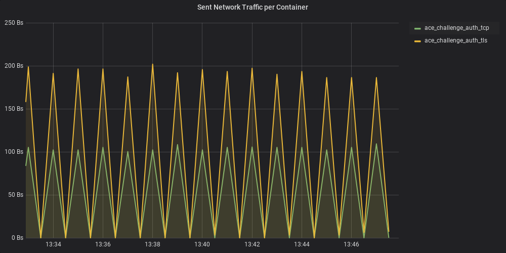 
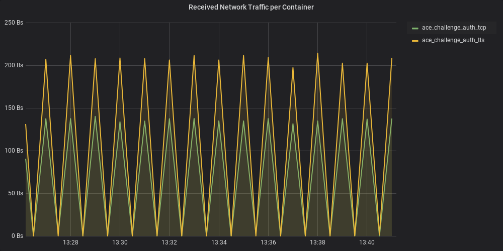 

#### Simple v3 authentication
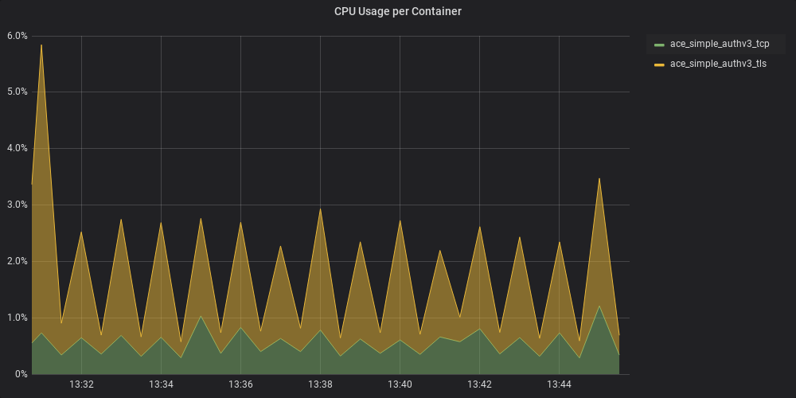 
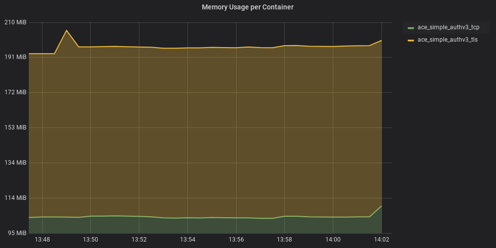 
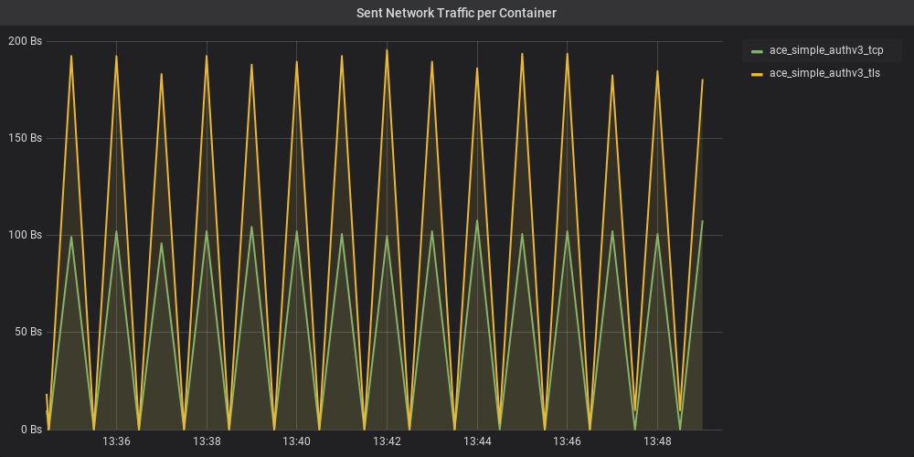 
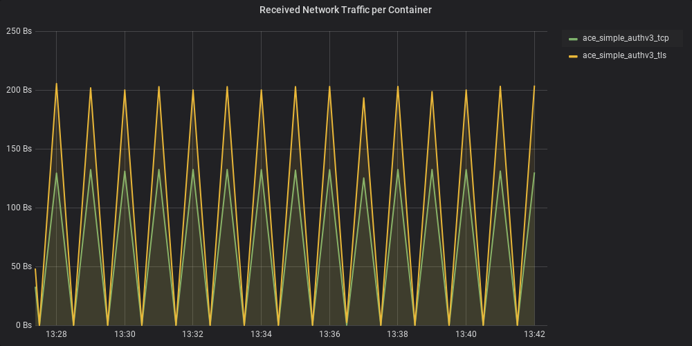

#### Simple v5 authentication
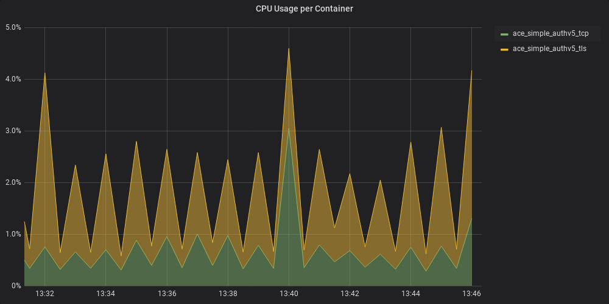 
 
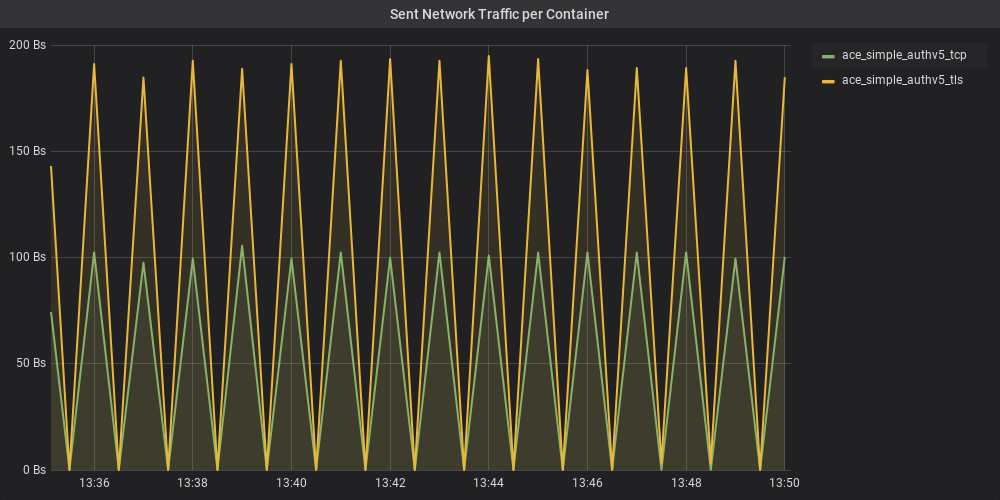 
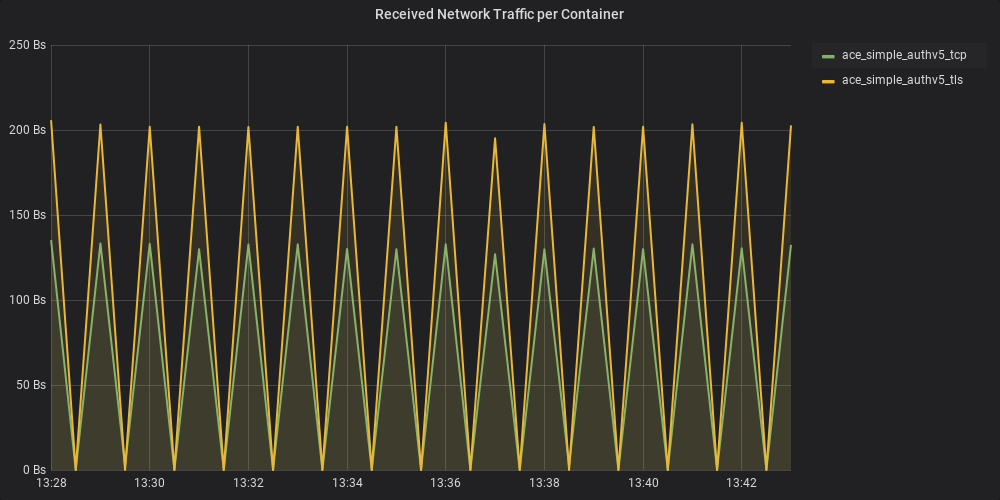

### MQTT operations performance

#### Publisher
The following procedure was followed by two ACE-MQTT client programs that maintain a persistent connection and publish often:

1. Connect with challenge authentication (MQTT version 5 clients). (NOT in the timeframe displayed in the diagrams)
2. Publish one message to humidity topic with payload "This is a message" and QOS 1.
3. Receive PUBACK.
3. Sleep for 2.5 minutes. Only Ping messages are expected to be exchanged in this timespan.
4. Go to step 2

 
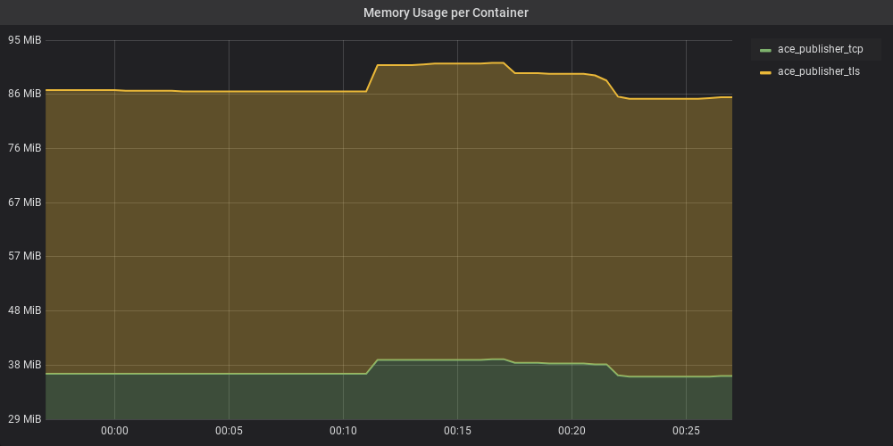 
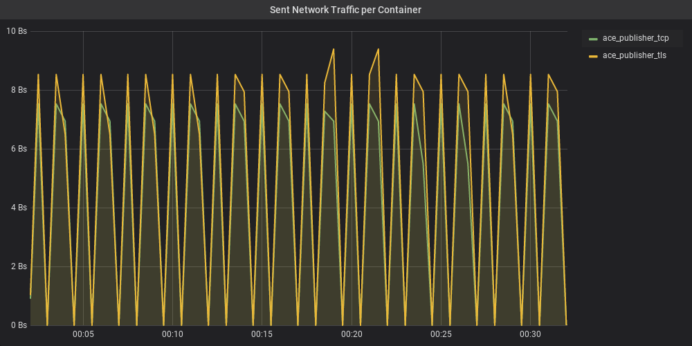 
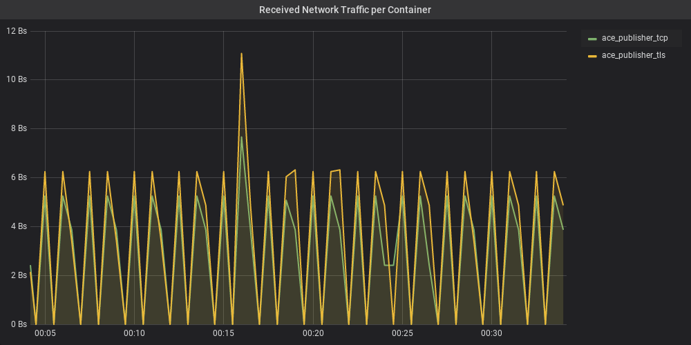 

#### Subscriber
The two ACE-MQTT client programs were monitored while listening to the messages of the above two publishers. The 
procedure followed was:

1. Client connects with challenge authentication (MQTT v3 clients). (NOT in the timeframe displayed in the diagrams)
2. Client subscribes to humidity topic with QOS 1. (NOT in the timeframe displayed in the diagrams)
3. Client receives a SUBACK. (NOT in the timeframe displayed in the diagrams)
3. Client sleeps until a message is received. Only Ping messages are expected to be exchanged in this timespan
4. Receive the two messages from the publishers above almost simultaneously every 2.5 minutes.
5. The received messages are logged on console. 
5. Go to step 3

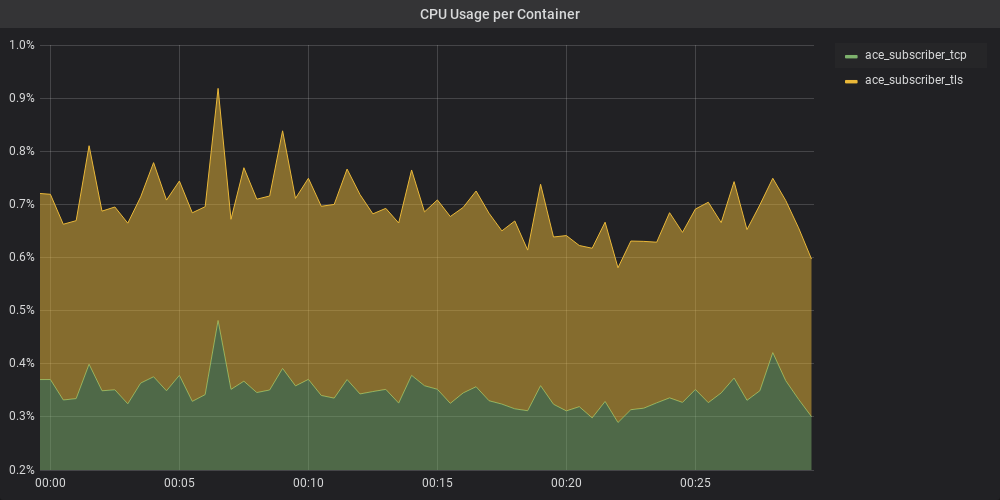 
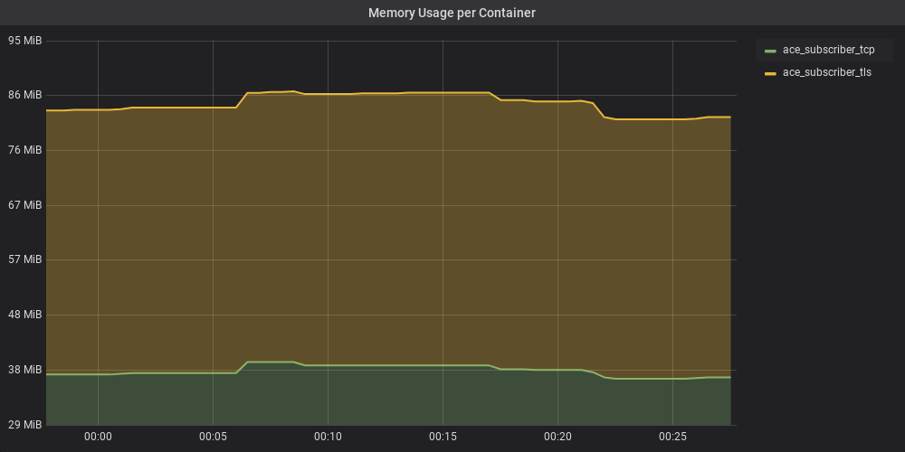 
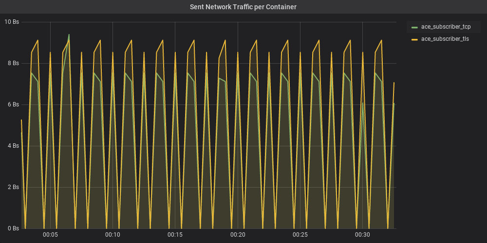 
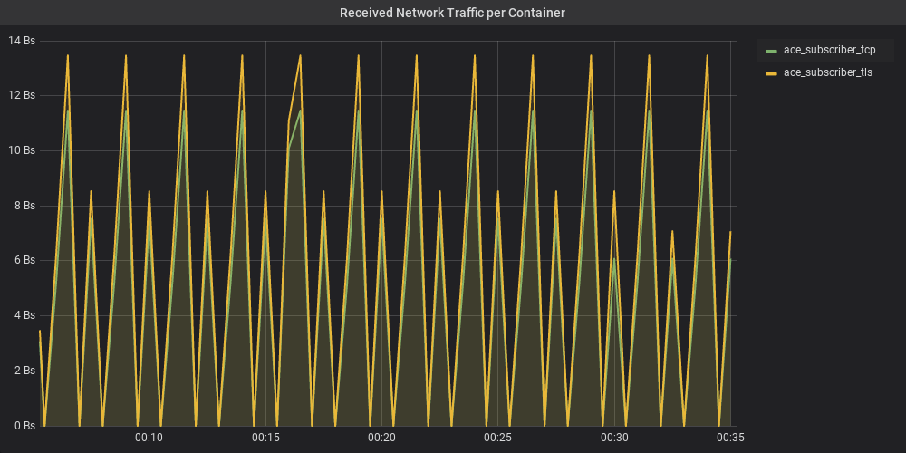

## Energy performance